# NovelNest - Book Tracking App
Project 4 - Brogan Carpenter

[View Live Project](https://novelnest-a822349b1444.herokuapp.com/)

1. [About the Project](#about-the-project)
2. [Agile Framework and Planning](#agile-framework-and-planning)
3. [Features](#features)
4. [Testing](#testing)
5. [Bugs](#bugs)
6. [Validator Testing](#validator-testing)
7. [Deployment](#deployment)
8. [References](#references)

# About the Project

NovelNest is a website for book lovers who want to keep track of their reading. It’s designed to make organising your books easy, whether it’s ones you want to read, are currently reading, or have already finished. You can also add your own reviews and update them as you go.

## What it does

### Organises your books: 
Add books to lists like “Wish List,” “Currently Reading,” or “Completed” so you can stay on top of your progress.

### Leave reviews: 
Write reviews for the books you’ve read.
### Manage everything easily: 
Quickly move books between lists, update details, and keep everything neat and tidy.
### Clean, user-friendly design:
The site is easy to use and looks good on both desktop and mobile.

## Why use NovelNest?
NovelNest is built to make life easier for readers. It’s not just about tracking books – it’s about enjoying the process of reading, reflecting on what you’ve read, and keeping your library organised. Whether you’re tackling a massive to-read pile or keeping track of favourites, NovelNest is your go-to tool.

## NovelNest Visuals
Homepage View

Login as a User
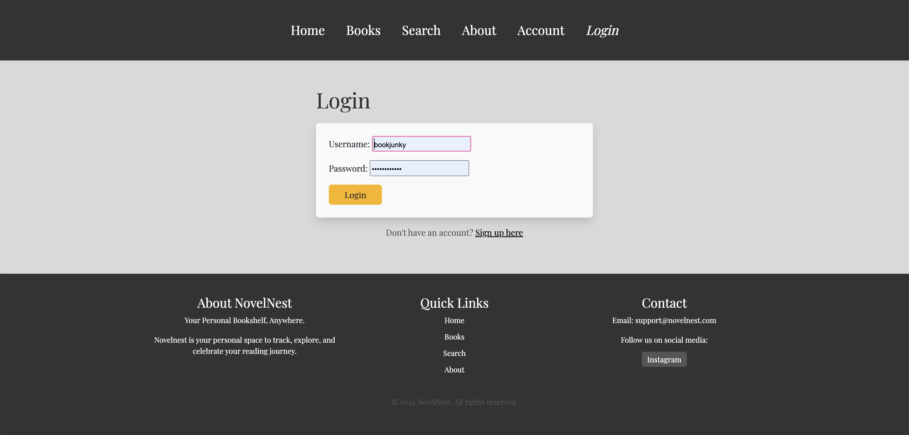
Viewing your personal Book List
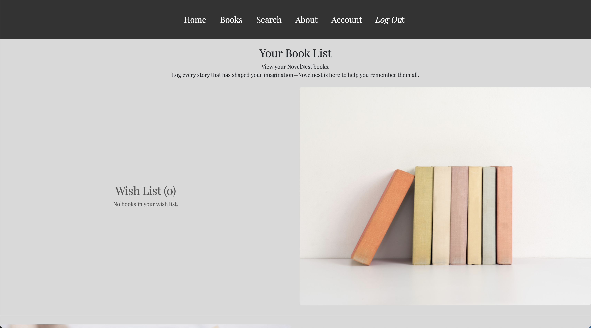
Add a Book to your List

Book Details
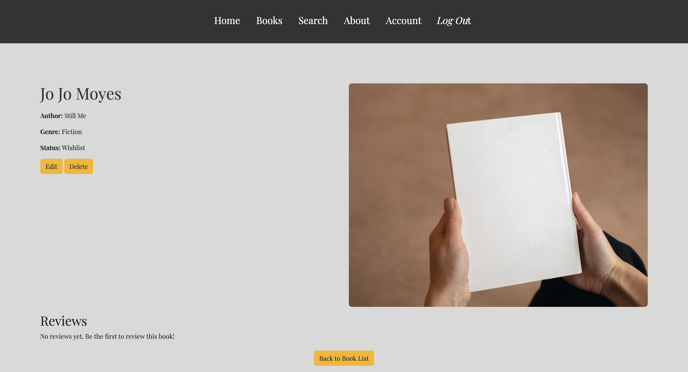
Search for Books
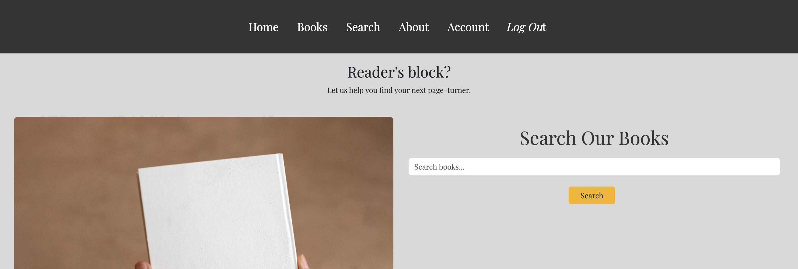
Footer Styling

# Agile Framework and Planning

## User Goals / Project Goals
User Goals
- Discover and Add Books
- Leave Reviews
- Organise Books
- Explore Recommendations
- Access Anywhere

Project Goals
- Build a Functional Platform
- Implement User Authentication
- Optimise Performance
- Test and Debug
- Deploy a Live Application
- Ensure Accessibility
I used Agile frameworks to organise and manage my project efficiently. GitHub Projects was the main tool I used to implement this system.

## Agile Framework

- I created a template in Issues to work from which were my User Stories and Acceptance Criterias for each task.
- I created User Stories for tasks and assigned them labels such as "must-have," "should-have," and "could-have" to prioritise what needed to be done.
- I then created 3 x columns called, 'Todo', 'In Progress' and 'Done'.
- I created a workflow, which instructed that when an issue (User Story) was created and connected to the NovelNest Project it would automatically go into the 'Todo' category. I then can edit the issues and move them along to 'In Progress' and 'Done'.
- To stay on track, I used milestones to set timeframes for larger sections of the project and work towards specific deadlines.

Examples of my User Stories:
- 
- 
- 
- 

This approach helped me keep my workflow organised and focus on delivering the most important features first.

See examples of my 'Project Plan' on Github.

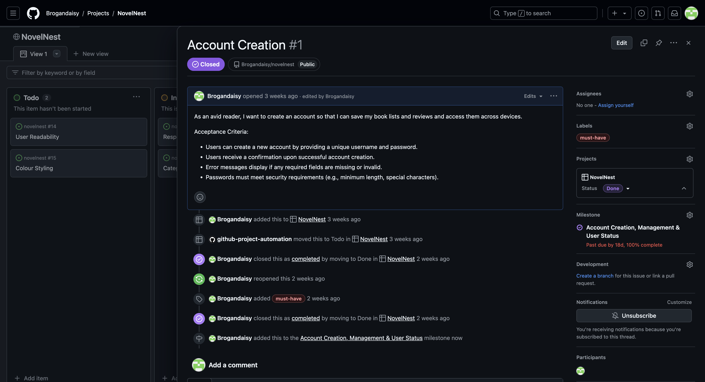

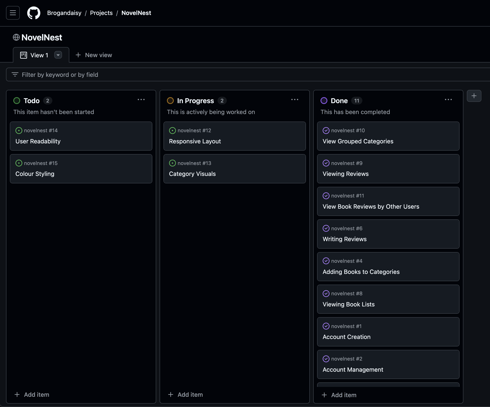

## Wireframes / Initial Design
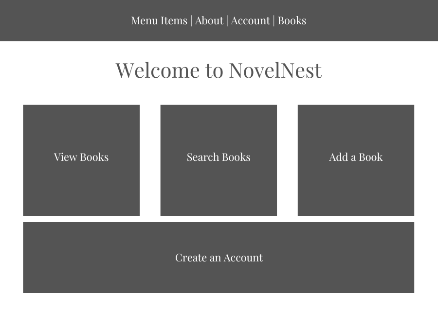
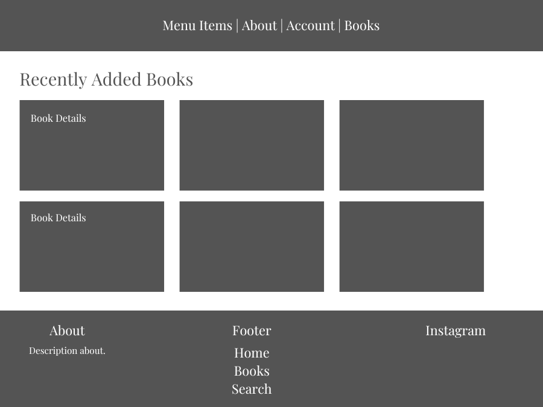
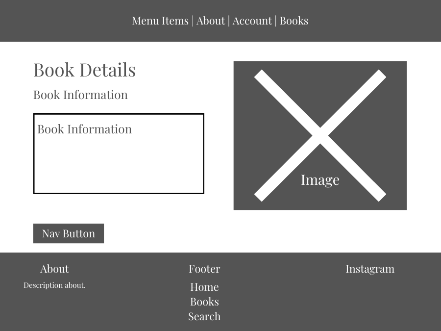

# Features

## Create an account with a username and password
Users can register on the platform using Django's built-in authentication system. The form is styled with Bootstrap classes for a clean, user-friendly design.

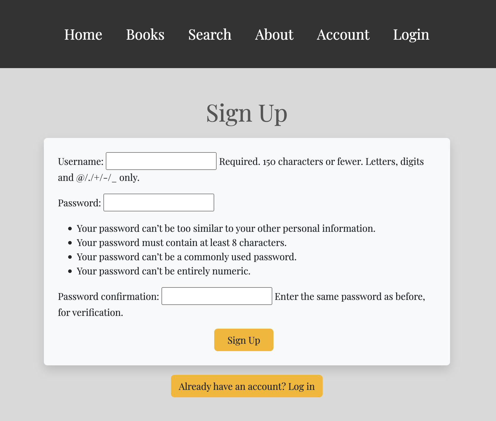

## Login and Logout
Users can log in and log out securely using Django’s built-in authentication system. The dynamic login/logout button in the Bootstrap navbar updates based on the user’s session state. 



## Change Password
The password change feature uses Django’s built-in PasswordChangeView, which allows users to securely update their passwords. I’ve customised this functionality by creating a CustomPasswordChangeView that uses a personalised form template (password_change_form.html) and a confirmation page (password_change_done.html). Both templates extend base.html to match the styling and layout of the rest of the website, providing a consistent and user-friendly experience for anyone updating their password.

          class CustomPasswordChangeView(PasswordChangeView):
              template_name = "registration/password_change_form.html"  # Ensure this file exists
              success_url = reverse_lazy('password-change/done')  # Matches the name in your URLs

## Upload a book with details (author, title, and genre)
Users can submit book details via a Django form, including author, genre and title, which validates input and saves the data to the database. Bootstrap is used for form styling to ensure responsive layout.

     class BookCreateView(LoginRequiredMixin, CreateView):
        model = Book
        template_name = "books/book_form.html"
        fields = ["title", "author", "genre", "status"]
        success_url = reverse_lazy(
            "book_list"
      )  # Redirects to the book list view/page after adding a book
    
    def form_valid(self, form):
        form.instance.added_by = self.request.user  # Connects the user to the book
        messages.success(
            self.request, "Book added successfully!"
        )  # Displays book added success message
        return super().form_valid(form)

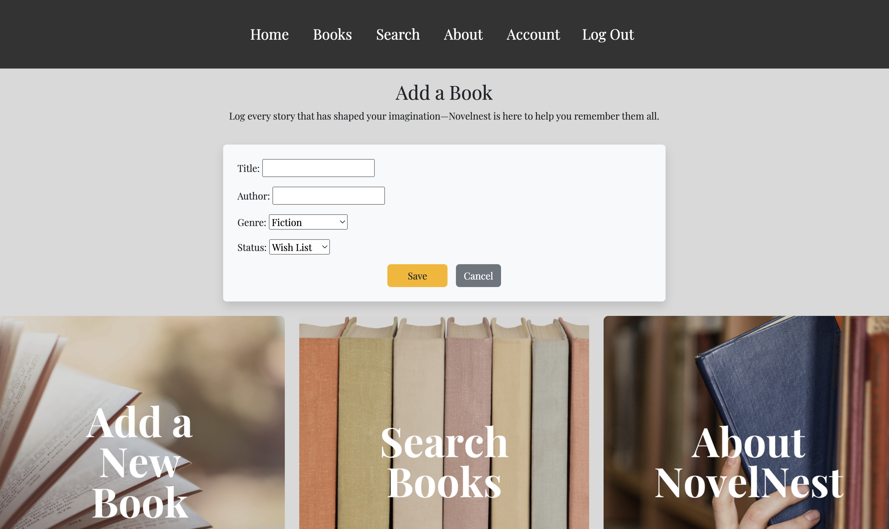

## Select a category for the book (Wish List, Currently Reading, Completed)
A dropdown menu, created with HTML and styled using Bootstrap, lets users assign books to categories. The selection updates dynamically in the database.

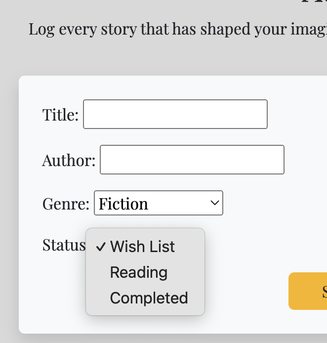

## Edit, amend or delete uploaded books, and move them between categories
Users can edit book details using Django's update view, with form fields pre-populated from the database. When deleting a book from the users lists, an alert page is displayed to confirm deletion. The webpage redirects to the book detail page once saved, or deleted.

The edit and delete buttons only display if the logged in user has uploaded the book they are viewing.

      

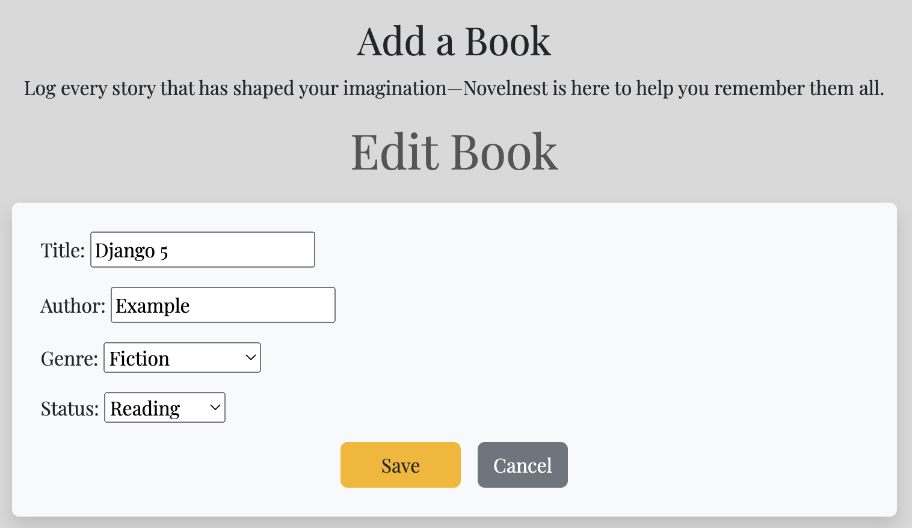

## Book list page with a count of books in each category
A Django query creates book counts by category and puts them dynamically in the template. 

    from django.db.models import Count
    
    context["wish_list_count"] = context["wish_list_books"].count()
        context["reading_count"] = context["reading_books"].count()
        context["completed_count"] = context["completed_books"].count()

The feature counts how many books are in each category (Wish List, Currently Reading, and Completed) using Django’s .count() method. These totals are sent to the template to show users a summary of their books.

The page layout uses a Bootstrap grid to display book lists and category counts clearly.

## Search bar function to search books by author or title
The search feature uses Django ORM to query the database for books based on user input, with results displayed in real-time. 

The BookSearchView class uses get_queryset to find books by title or author based on a search term (q) from the URL. If no search term is provided, it shows no results.

    class BookSearchView(ListView):
        model = Book
        template_name = "books/book_search.html"
        context_object_name = "search_results"

    def get_queryset(self):
        query = self.request.GET.get("q", "")
        if query: 
            return Book.objects.filter(
                Q(title__icontains=query) | Q(author__icontains=query)
            )
        return Book.objects.none()

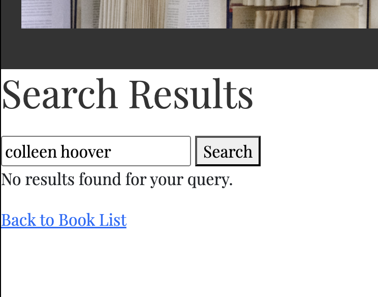

## View book details (author, title, and reviews)
Individual book pages dynamically pull data using Django views. It also includes the books reviews, and shows a review form to write a review but only to logged-in users who meet certain conditions (e.g., the book they have uploaded is marked as "Completed" or they search a book which wasn't uploaded by them). 

          class BookDetailView(DetailView):
    model = Book
    template_name = "books/book_detail.html"

    def get_context_data(self, **kwargs):
        context = super().get_context_data(**kwargs)
        context["reviews"] = self.object.reviews.all()  # Fetch all reviews for the book
        
        if self.request.user.is_authenticated:
            # Only show the review form to logged-in users
            if self.object.status == "Completed" or self.object.added_by != self.request.user:
                context["review_form"] = ReviewForm()
        return context

If the user views a book which they did not upload to their account, they can leave a review but have to tick a tickbox confirming they have 'read the book'. This way, reviews stay for users who have read the book and they are trusted for other users.

        if self.object.added_by != request.user:
            has_read = request.POST.get("has_read")
            if not has_read:
                messages.error(request, "You must confirm you have read the book before leaving a review.")
                return redirect(self.object.get_absolute_url())

## Dynamic data: Recently uploaded books and most-reviewed books
The homepage uses Django queries to pull data dynamically, showing the 6 most recent books and 3 most-reviewed books. These are displayed using Bootstrap card decks for a visually engaging layout. This feature has been used on various other pages, where I would like to display other books for users to see. These will change when more books are being uploaded to the database.

          def homepage(request):
    recent_books = Book.objects.order_by('-id')[:6]  # Get the 6 most recent books
    most_reviewed_books = Book.objects.annotate(review_count=Count('reviews')).order_by('-review_count')[:3]  # Get the 3 most reviewed books
    return render(request, 'books/homepage.html', {
        'recent_books': recent_books,
        'most_reviewed_books': most_reviewed_books,
    })

## Logged in vs Logged Out Views - LoginRequiredMixin
The LoginRequiredMixin is used throughout the class base views within books/views.py to restrict access to certain views, like the book list, ensuring only logged-in users can view them, while other views, like the book detail view, are accessible to everyone but display additional content or functionality for logged-in users.

Logged In Content:
     
     class BookListView(LoginRequiredMixin, ListView):
         model = Book
         template_name = "books/book_list.html"

Logged Out Content:
     
     class BookDetailView(DetailView):
         model = Book
         template_name = "books/book_detail.html"

## Bootstrap Styling
I used Bootstrap to style my project because it made it easy to create a clean, organised, and responsive design. I used its grid system to align content into rows and columns, styled buttons, forms, and navigation bars, and applied utility classes for spacing and alignment. Bootstrap’s pre-built components and responsive design features helped ensure the website looks good and works well on all screen sizes.

For example:

I used Bootstrap’s grid layout with its 12-column system to create a clean and organised design. By dividing the page into rows and columns, I was able to align content neatly and ensure it looks good on all screen sizes.

      

    

        <!-- Book Details Section -->
        

            <h1>{{ object.title }}</h1>
            
<strong>Author:</strong> {{ object.author }}

            
<strong>Genre:</strong> {{ object.get_genre_display }}

            
<strong>Status:</strong> {{ object.status }}

            

                
                <a class="btn btnMain" href="">Edit</a>
                <a class="btn btnMain" href="">Delete</a>
                
            

        

        <!-- Image Section -->
        

            
        

    

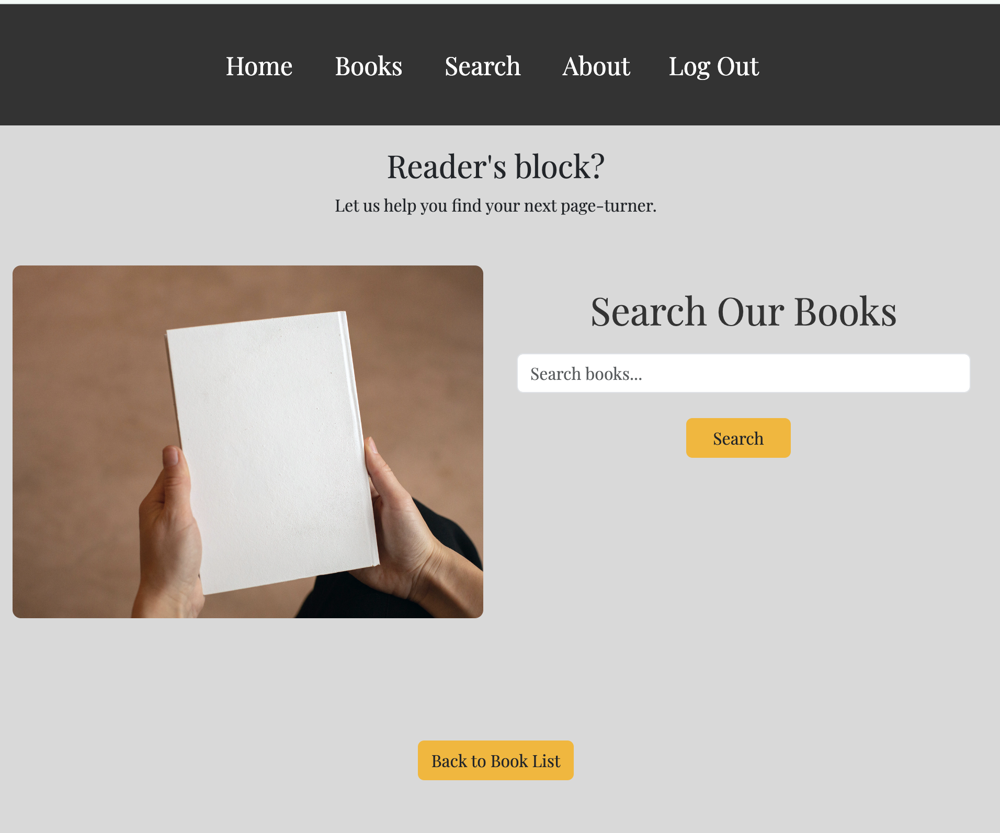

Another example using Bootstrap utility classes like mt-3, p-4, or text-center for spacing, alignment, and text styling.

        

    <!-- Wish List Section -->
    

        

            <h2>NovelNest</h2>
            <h4>Welcome to the nest where your literary adventures take flight.</h3>
                 
            
Novelnest is your personal space to track, explore, and celebrate your reading journey. 
                Whether you’re diving into a classic or discovering the next bestseller, Novelnest helps you catalogue books you’ve read,
                create a wishlist of titles to explore, and share reviews with a vibrant community of book lovers. With intuitive tools
                to organise your library and personalised recommendations, we make it easy to nurture your love for reading—all in one place. 
            
            
        

    

## File Storage and Database
For NovelNest, I’ve set up static file storage and database management to ensure the app runs efficiently.

- Static File Storage: I used Whitenoise to handle and serve all the static files, like CSS, JavaScript, and images, directly from the app. This means I don’t need an external service for static file hosting. 

- Database: For the database, I integrated PostgreSQL. It’s hosted on Heroku, and I’ve configured it using the dj-database-url package. This connects my Django app to the database automatically using Heroku’s DATABASE_URL environment variable.

## CRUD Functionality
Authenticated users in NovelNest have full CRUD (Create, Read, Update, Delete) functionality for managing their books and reviews. For example:

Create: Users can add new books or leave reviews on books.
Read: Users can view details of books, including reviews and genres.
Update: Users can edit books they’ve added or update their reading category.
Delete: Users can remove books they’ve added.
Only admin users have enhanced privileges, such as managing all user submissions and accessing the admin panel.

## Forms.py
forms.py manages user input for NovelNest, by providing structured forms for specific tasks. Within my project, the ReviewForm is linked directly to the Review model, allowing users to submit and save reviews with customised styling for better usability. The SearchForm, meanwhile, provides a clean and intuitive interface for users to search for books, with validation and Bootstrap styling for a polished user experience.

        from django import forms
        from .models import Review

        class ReviewForm(forms.ModelForm):
        class Meta:
            model = Review
            fields = ["content"]
            widgets = {
                    "content": forms.Textarea(
                        attrs={
                            "rows": 2,
                            "style": "width: 100%;", 
                            "placeholder": "Write your review here...",
                        }
                                ),
                }

        class SearchForm(forms.Form):
            query = forms.CharField(
                max_length=100,
                required=False,
                widget=forms.TextInput(attrs={"placeholder": "Search for books...", "class": "form-control"}),
            )
## Models.py
In my models.py, the Book model represents a book's details, allowing users to add books with specific categories. It includes fields like title and author, as well as status and genre fields, which use predefined choices to ensure consistency when categorising books. The added_by field links each book to the user who added it, and methods like __str__ and get_absolute_url provide user-friendly representations and URL paths for accessing individual book details.

# Testing
To ensure my project was functioning correctly and free of errors, I conducted thorough testing across different aspects of the application. This included validating my HTML and CSS, checking server logs during deployment, and performing manual user testing.

## Testing HTML and CSS
- I used online validation services to check my HTML and CSS for errors, ensuring the structure and styling were correct.
- Both passed without any errors, confirming that my code adheres to web standards.

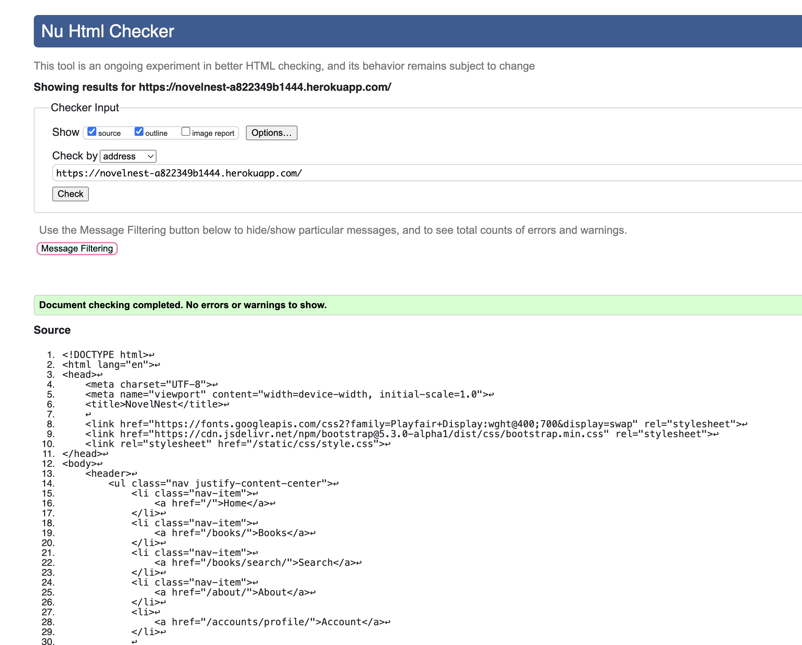
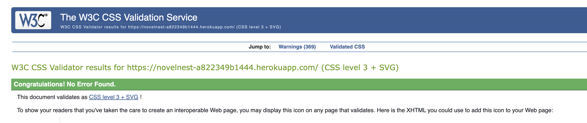

## Testing During Deployment
- I utilised the Heroku command: heroku logs --tail --app your-app-name to monitor logs for errors during deployment.This helped me identify and fix issues with my Django code, database migrations, or server setup.

## Manual User Testing
I interacted with the app as a user to test functionality and workflows:
- Creating accounts: Tested the user registration process to ensure accounts could be created without issues.
- Managing books: Added, edited, and deleted books multiple times to confirm the functionality was working as expected.
- Leaving reviews: Submitted reviews for books to ensure the review system operated correctly and saved data properly.

I repeated these actions after every significant code edit to confirm changes didn’t break existing functionality.

## Testing on Devices
I tested my app manually on different devices like phones, tablets, and desktops. This helped me check that the layout, design, and features worked well and looked good on all screen sizes.

Devices checked:
- iPhone 15 Pro - Chrome
- iPhone 12 Mini - Safari
- Windows 11 - Edge
- Android Samsung Galaxy S23 - Firefox
- iPad 11 Pro - Safari

See examples of visuals of my device testing.

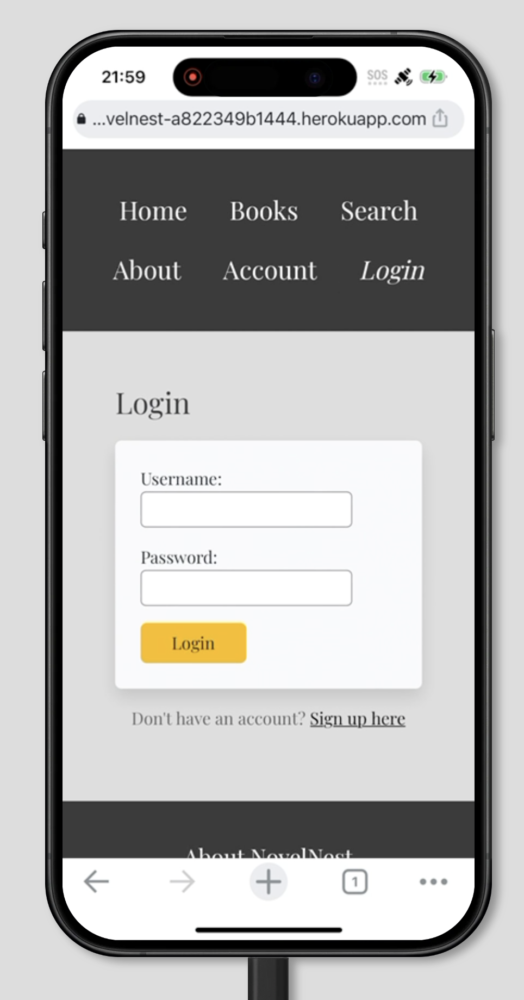
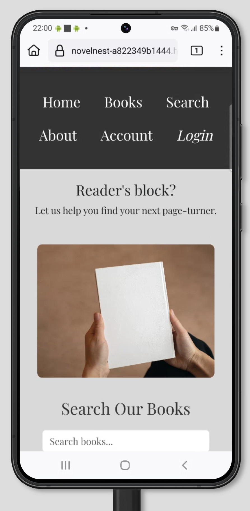
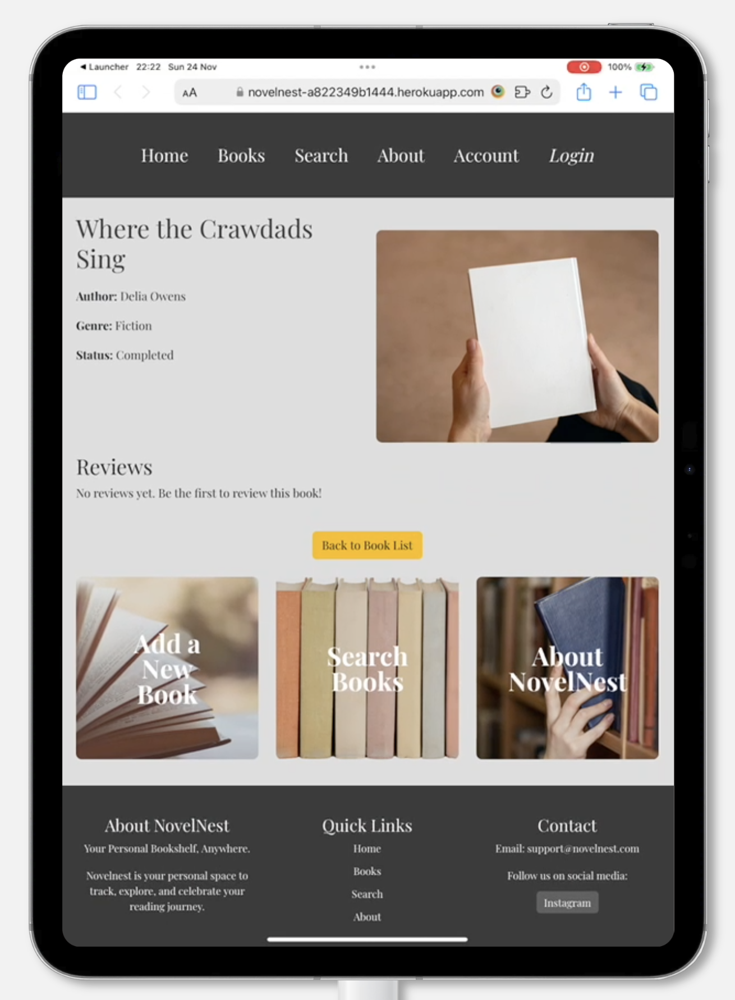

## Lighthouse Testing
I used Lighthouse testing to evaluate the performance, accessibility, and best practices of my app, ensuring it meets web standards and provides a good user experience.

My first Lighthouse test returned a less than average score. With suggestions to resize and compress images and remove any unwanted css. I then made these changes and the score improved.

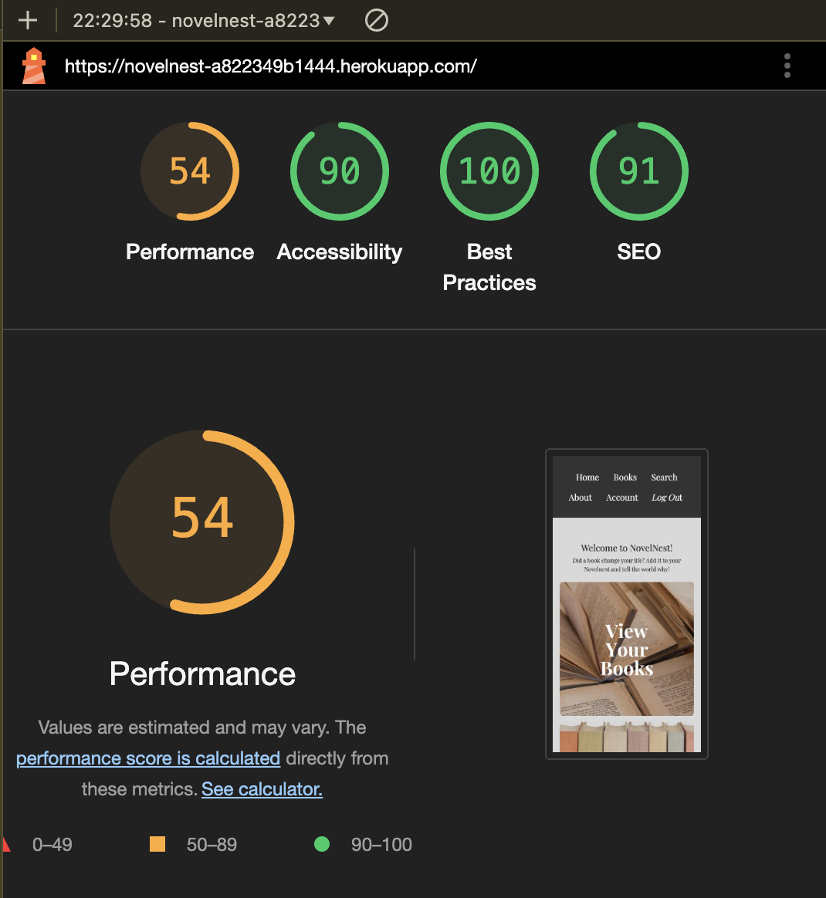

# Bugs
During the development, testing, and deployment of the project, I encountered a range of bugs that required careful troubleshooting and debugging. Here’s a summary of some of the key issues:

- Syntax Errors: Common mistakes like capital letters, incorrect indents, misspellings, misplaced commas, and other minor syntax issues in Django views, models, and Bootstrap styling caused disruptions.
- File Tree Problems: Authorisation folders were placed in the wrong directories, and there were duplicate templates/registration folders. The file structure was reorganised, and settings.py was updated for static files, including fixing STATIC_ROOT = BASE_DIR / 'staticfiles'.
- Templates Not Rendering: Templates failed to load due to an incorrectly configured static root, which was corrected to ensure templates pulled through as intended.
- Class names not pulling through css styling whilst using Bootstrap. I stripped it back to basics to debug and allow the Bootstrap styling to take control. For example with book_detail.html, as you can see from my commits to gibhub. (See example of issue below)
- Deployment Bugs: Issues included missing whitenoise from the requirements.txt file and an incorrect database URL, both of which required updates to the configuration.
- Review Functionality: The review feature wasn’t distinguishing between logged-in and logged-out users. Trial and error with Class-Based Views (CBVs) was used to refine the logic so the feature behaved as intended.
- Search Bar Issues: The search bar stopped functioning because it wasn’t pulling books from the database. The issue was traced back to using an incorrect query parameter, which was fixed by changing the parameter to q.
- Port 8000 Not Working: The application wouldn’t run on port 8000 without starting PostgreSQL first. The issue was resolved by ensuring docker start novelnest-postgres was executed before running the server.
- Features Not Working: When logged in and searching for books, the "edit/delete" functionality stopped working because the conditions in views.py were not correctly implemented or were not being properly passed to the template context. This issue was resolved by reviewing and scaling back the styling, ensuring template inheritance was correctly structured, and verifying that all necessary imports and Django functions were included in the appropriate views, templates, and folders.
  
I continuously checked for bugs by running the server with python manage.py runserver 0.0.0.0:8000 and testing functionality such as creating new users, logging in and out, viewing, adding, and deleting books, and changing passwords. Each function was tested thoroughly during development and whenever I updated styling or layouts to ensure everything worked as expected.

A recurring issue I faced was features breaking due to missing or incorrect imports of Django functions in views, templates, or other files. To address this, I now thoroughly check that all necessary imports and dependencies are correctly included in the appropriate places during development.

## Styling Debug Example
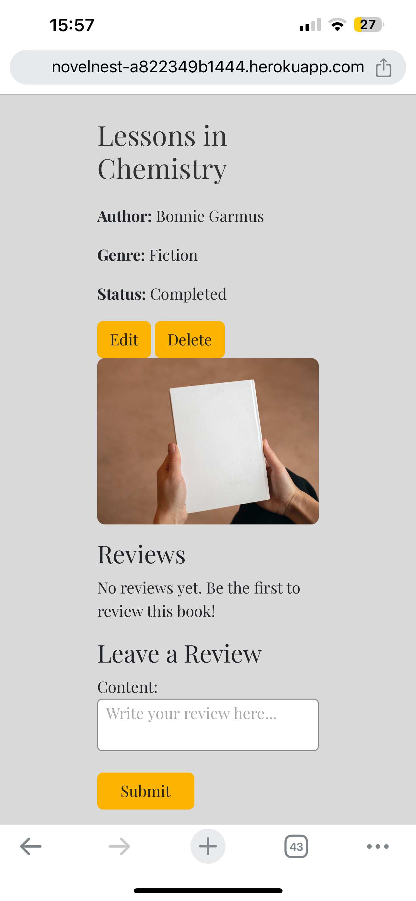

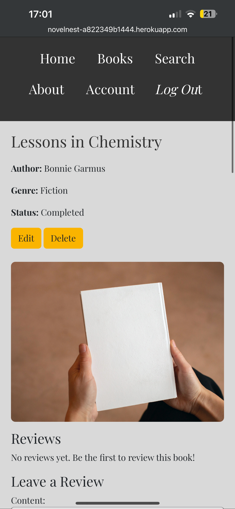

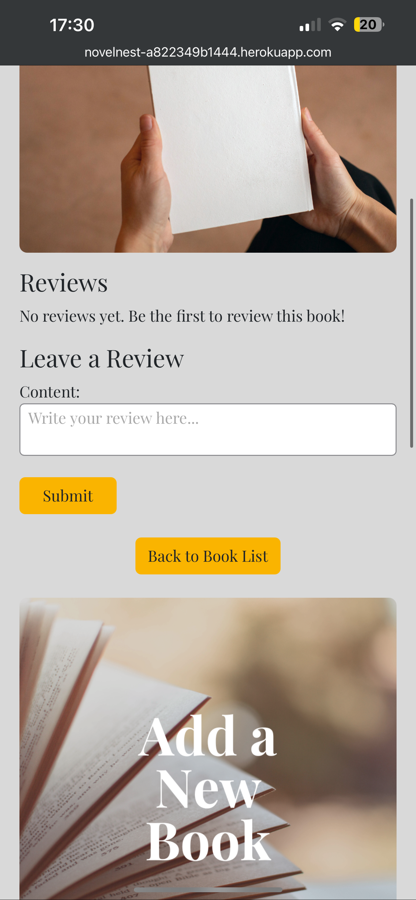

# Deployment

### Set Up My Project Locally:
- I made sure my Django app was fully functional and working locally.
- Installed necessary libraries like gunicorn, dj-database-url, and whitenoise and added them to requirements.txt.
- Created a Procfile to specify how Heroku should run my app, e.g., web: gunicorn <my_project_name>.wsgi.

### Prepare My App for Heroku:
- Ensured heroku was installed on gitpod, using the command 'Install heroic brew tap heroku/brew && brew install heroku'
- Configured STATIC_ROOT and integrated Whitenoise to manage static files in settings.py.
- Updated DATABASES to use dj_database_url to parse Heroku’s DATABASE_URL.
- Checked that ALLOWED_HOSTS included Heroku’s domain.

### Create My Heroku App:
- Used heroku to create the app and connect it to my Git repository. (app = novelnest) Ensuring it was set to EU.
- Amend and add Config Vars, including SECRET_KEY, DATABASE_URL, HEROKU_POSTGRESQL_JADE_URL and PORT.

### Set Up Environment Variables:
- Set environment variables like SECRET_KEY using heroku config:set.
- Temporarily disabled collectstatic with heroku config:set DISABLE_COLLECTSTATIC=1 to avoid deployment errors until my static files were sorted.

### Push My Code to Heroku:
- Deployed the app by running git push heroku main.

### Migrate the Database:
- After deployment, I applied database migrations on Heroku using heroku run python manage.py migrate.

### Process when making changes & updating repoistory
> git add . git commit -m "Describe your changes"

> git push origin main

> git push heroku main

> heroku logs --tail --app your-app-name (This checks for any error messages)

# References
I used the following resources to complete this project.

- W3Schools for pandas library explanation, and how to include an enumerate function, and how to round the age to the nearest whole number
- Love Sandwiches walk through project for deployment, and googlesheet import/connection

Author - Brogan Carpenter
